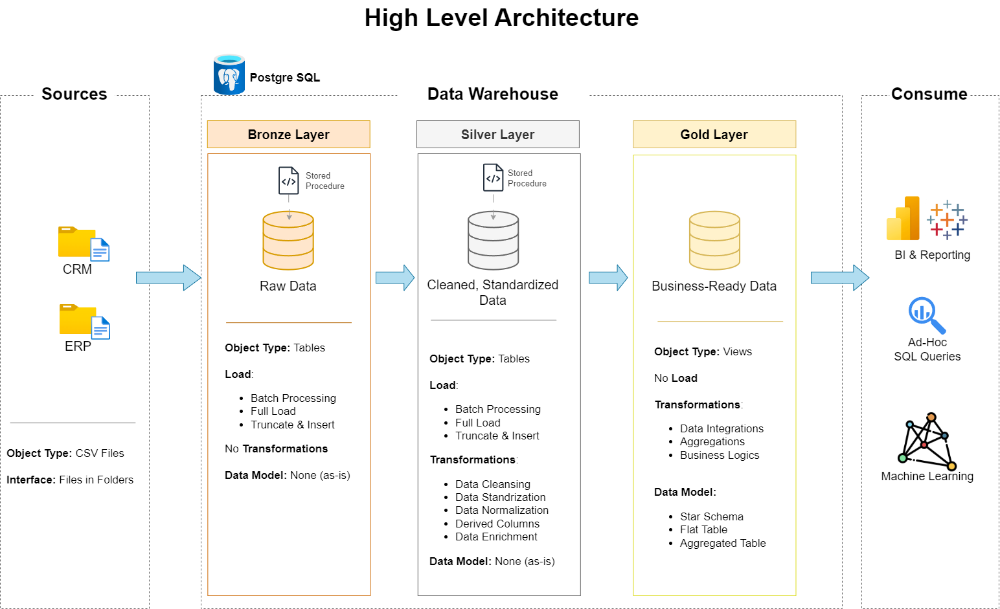

# 🌟 **Modern Data Warehouse & Analytics End-to-End Project**  

👋 Hello, Data Points! 
- Welcome to this data warehouse project!
- This project demonstrates modern data warehouse architecture and SQL analytics.

Welcome to this **Modern Data Warehouse & Analytics End-to-End Project** project using **PostgreSQL**! 🎯  

## 🪄Modern Data Warehouse & Analytics End-to-End Project overview


This repository provides a **step-by-step** approach to building a **scalable, efficient, and analytics-ready data warehouse**. It covers:  
✅ **ETL Pipelines** (Extract, Transform, Load)  
✅ **Data Modeling** (Star Schema)  
✅ **Exploratory Data Analysis (EDA)**  
✅ **SQL-based Reporting & Analytics**  
✅ **Advanced-Data Analytsis & Reporting**  
📝 **Project Documentation**

---

## 🏗️ **Data Architecture Overview**  

The project follows the **Medallion Architecture** with three layers:  

📌 **Bronze Layer (Raw Data)** – Stores data directly from the source (CSV files).  
📌 **Silver Layer (Cleansed & Transformed Data)** – Data is cleaned, structured, and normalized.  
📌 **Gold Layer (Business-Ready Data)** – Optimized for analytics and reporting using a **star schema**.  

### **🌐 Architecture Diagram:**  



---

## 📖 **Project Overview**  

### 📌 **Key Features & Highlights:**  

- **End-to-End Data Pipeline** – From raw data to business insights
- **Automated ETL System** – Scripts for running, scheduling, and monitoring ETL jobs
- **Centralized Configuration** – Dynamic configuration system for file paths
- **Comprehensive Documentation** – Architecture diagrams, data dictionaries, and more
- **Modular Design** – Easily extendable for additional data sources
- **Best Practices** – Following industry standards for data warehousing
- **Performance Optimization** – Efficient SQL queries and indexing strategies

### 🛠️ **Tech Stack:**  
- **Database:** PostgreSQL  
- **ETL Processing:** SQL, Python (optional)  
- **Data Visualization:** Power BI / Tableau (optional)  
- **Documentation & Diagramming:** Draw.io, Notion  

---

## 📂 **Repository Structure**  

```
SQL-Data-Warehouse-Project/
├── automation/           # ETL automation and orchestration scripts
│   ├── run_etl.sh        # Main ETL execution script with error handling and logging
│   ├── schedule_etl.sh   # Script for scheduling ETL jobs using cron
│   └── etl_monitor.sh    # Monitoring script for ETL job status and performance
│
├── datasets/             # Raw data from ERP and CRM systems
│
├── docs/                 # Project documentation, architecture diagrams, and outputs
│   ├── bronze/           # Bronze layer documentation
│   ├── silver/           # Silver layer documentation
│   ├── gold/             # Gold layer documentation
│   └── warehouse/        # Overall warehouse architecture documentation
│
├── logs/                 # ETL execution logs
│
├── scripts/              # SQL scripts for ETL and transformations
│   ├── bronze/           # Bronze layer scripts
│   │   └── proc_load_bronze.sql  # Procedure to load data into bronze layer
│   ├── silver/           # Silver layer scripts
│   │   └── proc_load_silver.sql  # Procedure to transform data to silver layer
│   ├── gold/             # Gold layer scripts
│   │   └── ddl_gold.sql  # Scripts to create gold layer tables and views
│   ├── config_paths.sql  # Configuration table for file paths
│   └── init_database.sql # Script to create the database and schemas
│
├── tests/                # Test scripts and quality control files
│
├── report/               # Analysis scripts and reports
│   ├── 1_gold_layer_datasets/  # Datasets used for reporting
│   ├── 2_eda_scripts/    # EDA scripts
│   └── output/           # Output from analysis
│
├── CONFIG_README.md      # Configuration system documentation
├── README.md             # Project overview and instructions
├── LICENSE               # License information
└── requirements.txt      # Project dependencies
```  

---

## 🌊 Data Flow

---

## 🚀 **Project Requirements**  

### 👨‍💻 **Data Engineering: Building the Data Warehouse**  
**Goal:** Develop a **PostgreSQL-based** data warehouse consolidating **sales data** for analytical reporting.  

✔️ **Data Sources:** Import from **ERP & CRM (CSV files)**  
✔️ **Data Quality:** Cleaning & handling missing values  
✔️ **Integration:** Merging datasets into a **single analytical model**  
✔️ **Data Modeling:** Implementing a **star schema** (Fact & Dimension tables)  
✔️ **Documentation:** Clear **metadata & model descriptions**  


## 📊 **BI: Analytics & Reporting**  

📌 **Key Business Insights:**  
🔸 **Customer Behavior Analysis** – Understanding buying patterns  
🔸 **Product Performance Metrics** – Evaluating top-performing items  
🔸 **Sales Trend Analysis** – Identifying revenue patterns  

**Outcome:** 📈 Actionable reports for data-driven **business decisions**!  

---

## 📰 Report - Data Analysis and Business Insights

This section summarizes the data analysis process and the resulting reports, providing valuable business insights.


## 🎏 Data Exploration and Analysis

The analysis followed a structured approach, covering various aspects of the data:

1.  **Database Exploration:** Understanding the structure and relationships within the database.
2.  **Dimensions Exploration:** Analyzing the characteristics of the dimension tables (customers, products).
3.  **Date Range Exploration:** Identifying the time period covered by the data.
4.  **Measures Exploration:** Examining key metrics and their distributions.
5.  **Magnitude Exploration:** Understanding the scale of different measures.
6.  **Ranking Analysis:** Identifying top performers (e.g., customers, products).
7.  **Change Over Time Analysis:** Tracking trends and patterns over time.
8.  **Cumulative Analysis:** Examining the accumulated values of metrics.
9.  **Performance Analysis:** Evaluating the performance of different aspects of the business.
10. **Data Segmentation:** Grouping data into meaningful segments for targeted analysis.
11. **Part-to-Whole Analysis:** Understanding the contribution of different parts to the overall picture.


The EDA process was conducted using  SQL queries. The results of the EDA are stored in the `output` directory within the `report` folder.

---
## 🛠️ **Setup & Installation Guide**  

### **🔹 Prerequisites:**  
- Install **PostgreSQL** → [Download PostgreSQL](https://www.postgresql.org/download/)  
- Clone this repository:  
  ```bash
  git clone https://github.com/BinaryNavigator07/Modern-Data-Warehouse-Analytics-End-to-End-Project
  ```
- Load sample datasets from the `/datasets/` folder.  

### **🔹 Configuration Setup:**
1️⃣ **Update Configuration:**
   - The project now uses a centralized configuration system with `config_paths.sql`
   - This file creates a configuration table (`config.file_paths`) that stores all file paths
   - Use the `config.get_path()` function to retrieve paths in your SQL procedures
   - See `CONFIG_README.md` for detailed instructions

### **🔹 Running SQL Scripts:**  
1️⃣ **Initialize Database:**  
   ```
   \i scripts/init_database.sql
   \i scripts/config_paths.sql
   ```
2️⃣ **Run ETL Scripts Manually:**  
   ```
   -- For Bronze Layer
   CALL bronze.load_bronze();
   
   -- For Silver Layer
   CALL silver.load_silver();
   
   -- For Gold Layer
   \i scripts/gold/ddl_gold.sql
   ```
3️⃣ **Run ETL with Automation:**  
   ```bash
   # Run the full ETL process
   ./automation/run_etl.sh
   
   # Schedule ETL jobs
   ./automation/schedule_etl.sh
   
   # Monitor ETL jobs
   ./automation/etl_monitor.sh
   ```
3️⃣ **Start Analysis:** Query tables to generate insights!  

---

## 🔗 **Useful Links & Resources**  

📌 **Project Assets:**  
- 📂 Dataset Folder: See the `datasets` directory
- 📝 Project Documentation: See the `docs` directory
- 🎨 [Diagramming Tool (Draw.io)](https://www.drawio.com/)  

---

## 📢 **Connect & Collaborate!**  

💡 **Want to contribute?** Fork this repo and submit a **pull request**!  
📩 **Got questions?** Open an **issue** or reach out to me!  


📧 Email: umaiesajid@gmail.com

